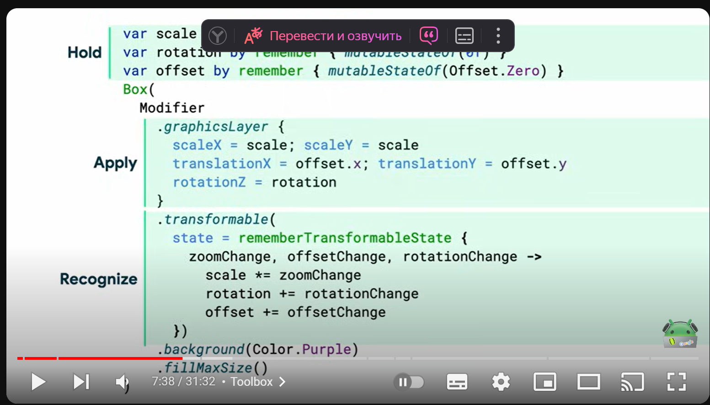
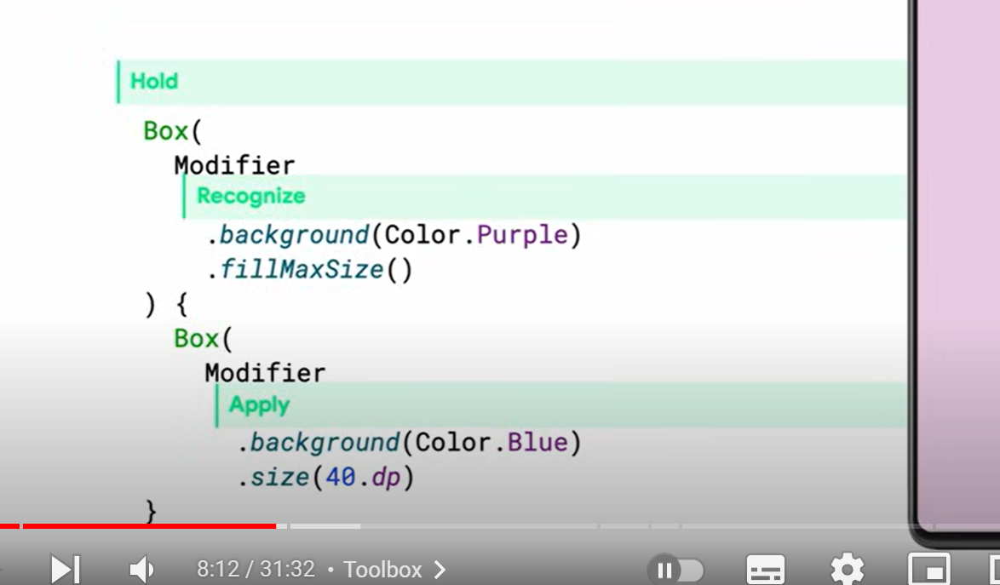

Теперь я понимаю твою задачу лучше. Ты хочешь, чтобы пользователь мог взаимодействовать с элементами на странице альбома — добавлять стикеры, перемещать их, изменять размер, а затем сохранять и возвращаться к редактированию в будущем.

### Основные шаги для реализации:

1. **Область страницы альбома**: Эта область будет представлять страницу альбома, где пользователь сможет размещать стикеры, изображения и текст. В качестве основы можно использовать контейнер типа `Box` или `Canvas`.

2. **Перетаскивание стикеров на страницу**: Пользователь сможет выбирать стикеры из набора вверху экрана и перетаскивать их на страницу. Это можно сделать с помощью жестов drag-and-drop.

3. **Изменение размера и перемещение элементов**: Для управления стикерами (или другими элементами) на странице необходимо добавить поддержку масштабирования и перемещения с помощью жестов.

4. **Сохранение состояния страницы**: Важно сохранять текущее положение, размер и состояние всех элементов, чтобы при повторном открытии пользователь мог продолжить редактирование.

5. **Просмотр страницы альбома**: После сохранения страница будет отображаться в режиме просмотра, но пользователь сможет в любой момент вернуться к редактированию.

### Пример реализации шаг за шагом

#### 1. **Область страницы альбома**

Создадим область страницы с возможностью добавления элементов:

```kotlin
@Composable
fun AlbumPage(
    stickers: List<Int>, // список стикеров
    onAddSticker: (Int) -> Unit // добавление стикера на страницу
) {
    Box(
        modifier = Modifier
            .fillMaxSize()
            .border(1.dp, Color.Black)
            .padding(16.dp)
    ) {
        // Тут будут стикеры
    }
    LazyRow(modifier = Modifier.fillMaxWidth()) {
        items(stickers) { sticker ->
            Image(
                painter = painterResource(id = sticker),
                contentDescription = null,
                modifier = Modifier
                    .size(50.dp)
                    .clickable {
                        onAddSticker(sticker)
                    }
            )
        }
    }
}
```

#### 2. **Добавление и перетаскивание стикеров**

Мы будем отслеживать позицию стикеров и позволять пользователю перетаскивать их по области страницы.

```kotlin
@Composable
fun DraggableSticker(
    stickerRes: Int,
    modifier: Modifier = Modifier
) {
    var offsetX by remember { mutableStateOf(0f) }
    var offsetY by remember { mutableStateOf(0f) }
    var scale by remember { mutableStateOf(1f) }

    Image(
        painter = painterResource(id = stickerRes),
        contentDescription = null,
        modifier = modifier
            .offset { IntOffset(offsetX.roundToInt(), offsetY.roundToInt()) }
            .graphicsLayer(scaleX = scale, scaleY = scale)
            .pointerInput(Unit) {
                detectTransformGestures { _, pan, zoom, _ ->
                    offsetX += pan.x
                    offsetY += pan.y
                    scale *= zoom
                }
            }
    )
}
```

Теперь, когда пользователь выбирает стикер, его можно перетаскивать по странице и изменять его размер.

#### 3. **Сохранение состояния страницы**

Для сохранения состояния страницы тебе нужно будет хранить данные о каждом стикере (его позиция, размер и т.д.) в `ViewModel` или любом другом классе, который управляет состоянием.

```kotlin
data class StickerState(val resource: Int, val offsetX: Float, val offsetY: Float, val scale: Float)

class AlbumViewModel : ViewModel() {
    var stickers by mutableStateOf(listOf<StickerState>())
        private set

    fun addSticker(stickerRes: Int) {
        stickers = stickers + StickerState(stickerRes, 0f, 0f, 1f)
    }

    fun updateSticker(index: Int, newState: StickerState) {
        stickers = stickers.toMutableList().also {
            it[index] = newState
        }
    }
}
```

Теперь все стикеры и их состояния будут сохраняться в модели.

#### 4. **Редактирование страницы альбома**

Когда пользователь возвращается к редактированию страницы, данные о всех стикерах будут загружаться из состояния.

```kotlin
@Composable
fun EditableAlbumPage(viewModel: AlbumViewModel) {
    val stickers = viewModel.stickers

    Box(modifier = Modifier.fillMaxSize()) {
        stickers.forEachIndexed { index, sticker ->
            DraggableSticker(
                stickerRes = sticker.resource,
                modifier = Modifier
                    .offset { IntOffset(sticker.offsetX.roundToInt(), sticker.offsetY.roundToInt()) }
                    .graphicsLayer(scaleX = sticker.scale, scaleY = sticker.scale)
                    .pointerInput(Unit) {
                        detectTransformGestures { _, pan, zoom, _ ->
                            val newState = sticker.copy(
                                offsetX = sticker.offsetX + pan.x,
                                offsetY = sticker.offsetY + pan.y,
                                scale = sticker.scale * zoom
                            )
                            viewModel.updateSticker(index, newState)
                        }
                    }
            )
        }
    }
}
```

### 5. **Просмотр страницы альбома**

Когда пользователь завершает редактирование, ты можешь просто отобразить все элементы в режиме просмотра, без возможности их перемещения:

```kotlin
@Composable
fun ViewAlbumPage(stickers: List<StickerState>) {
    Box(modifier = Modifier.fillMaxSize()) {
        stickers.forEach { sticker ->
            Image(
                painter = painterResource(id = sticker.resource),
                contentDescription = null,
                modifier = Modifier
                    .offset { IntOffset(sticker.offsetX.roundToInt(), sticker.offsetY.roundToInt()) }
                    .graphicsLayer(scaleX = sticker.scale, scaleY = sticker.scale)
            )
        }
    }
}
```

### 6. **Итог**

Этот подход позволит тебе создать интерфейс, где пользователь может:
- Добавлять стикеры на страницу альбома.
- Свободно перемещать и изменять их размер.
- Сохранять страницу и возвращаться к редактированию позже.
- Просматривать готовую страницу в режиме просмотра.

Весь этот функционал реализуем с помощью Android Jetpack Compose и гибкости в управлении состоянием.



what to do with svg:
Чтобы использовать SVG-стикер с градиентным фоном в виде точек в своём приложении, реализуя возможность добавления его на страницу альбома с помощью drag-and-drop, тебе нужно выполнить следующие шаги:

### 1. **Поддержка SVG в Android (Jetpack Compose):**

Для работы с SVG в Android можно использовать библиотеку **`coil-compose`** или **`Accompanist`** для загрузки и отображения SVG-изображений в Jetpack Compose.

- Добавь зависимости в `build.gradle`:
```groovy
implementation("io.coil-kt:coil-compose:2.0.0")
implementation("io.coil-kt:coil-svg:2.0.0")
```

### 2. **Импорт SVG файла в проект:**
SVG-стикер, который ты создал в Adobe Illustrator (AI), можно экспортировать как файл `.svg` и добавить его в папку ресурсов проекта (например, в папку `res/raw/`).

### 3. **Загрузка и отображение SVG в Jetpack Compose:**

Загружай и отображай SVG-изображение с помощью Coil. Пример использования в Jetpack Compose:

```kotlin
import androidx.compose.foundation.Image
import androidx.compose.foundation.layout.size
import androidx.compose.runtime.Composable
import androidx.compose.ui.Modifier
import androidx.compose.ui.graphics.Color
import androidx.compose.ui.unit.dp
import coil.compose.rememberAsyncImagePainter
import coil.decode.SvgDecoder
import coil.request.ImageRequest
import android.content.Context

@Composable
fun SvgSticker(context: Context) {
    Image(
        painter = rememberAsyncImagePainter(
            model = ImageRequest.Builder(context)
                .data("file:///android_res/raw/your_sticker.svg")
                .decoderFactory(SvgDecoder.Factory())
                .build(),
        ),
        contentDescription = "Sticker",
        modifier = Modifier.size(100.dp) // Установи размер стикера по необходимости
    )
}
```

### 4. **Добавление drag-and-drop функциональности:**

Теперь, чтобы добавить возможность перемещения стикера, можно использовать Jetpack Compose `Modifier.draggable` для перемещения стикера на странице.

Пример с drag-and-drop:

```kotlin
import androidx.compose.foundation.background
import androidx.compose.foundation.gestures.detectDragGestures
import androidx.compose.foundation.layout.Box
import androidx.compose.foundation.layout.offset
import androidx.compose.foundation.layout.size
import androidx.compose.runtime.*
import androidx.compose.ui.Modifier
import androidx.compose.ui.geometry.Offset
import androidx.compose.ui.input.pointer.pointerInput
import androidx.compose.ui.unit.IntOffset
import androidx.compose.ui.unit.dp
import kotlin.math.roundToInt

@Composable
fun DraggableSticker() {
    var offset by remember { mutableStateOf(Offset.Zero) }

    Box(
        modifier = Modifier
            .offset { IntOffset(offset.x.roundToInt(), offset.y.roundToInt()) }
            .size(100.dp)
            .background(Color.Transparent)
            .pointerInput(Unit) {
                detectDragGestures { change, dragAmount ->
                    change.consume()
                    offset += dragAmount
                }
            }
    ) {
        // Отображаем SVG стикер
        SvgSticker(context = LocalContext.current)
    }
}
```

### 5. **Интерактивное добавление стикеров:**

Тебе также нужно будет реализовать логику, которая позволяет пользователю добавлять новый стикер при нажатии кнопки. Это может быть что-то вроде динамического списка, в который добавляются новые стикеры, и каждый стикер можно перетаскивать.

```kotlin
@Composable
fun StickerAlbumPage() {
    var stickers by remember { mutableStateOf(listOf<Offset>()) }

    // Кнопка для добавления нового стикера
    Button(onClick = {
        stickers = stickers + Offset(0f, 0f) // Добавляем новый стикер в левый верхний угол
    }) {
        Text("Добавить стикер")
    }

    Box(modifier = Modifier.fillMaxSize()) {
        stickers.forEachIndexed { index, offset ->
            DraggableSticker()
        }
    }
}
```

### Заключение:
Теперь у тебя будет функциональность, позволяющая пользователям добавлять и перетаскивать стикеры на страницу альбома.

```kotlin
import java.lang.reflect.Modifier

var offset by remember { mutableStateOf(0f) }
var rotation by remember { mutableStateOf(0f) }
var scale by remember { mutableStateOf(0f) }
Box(
    // recognize
    Modifier
        .transformable(
            state = rememberTransformableState{
                zoomChange,  offsetChange, rotationChange ->
                scale *= zoomChange
                rotation += rotationChange
                offset += offsetChange
            }
        )
) {
    Box(
        // apply
        Modifier
            .graphicsLayer{
                scaleX = scale; scaleY=scale
                translationX = offset.x; translation = offset.y
                rotationZ = rotation
            }
    )
}
```