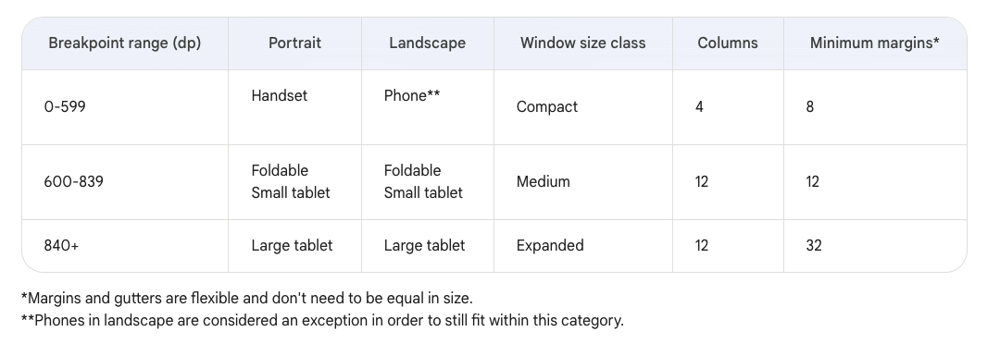

# Jetpack Compose

`onCreate ()` = `main ()`
An annotation is applied by prefixing its name (the annotation) with the `@` character at the
beginning of the declaration you are annotating. Different code elements, including properties,
functions, and classes, can be annotated.

Code - __Optimize Imports__ `CTRL ALT O`

## @Composable

Composable function takes some input and generates what's shown on the screen

- @Composable function names are capitalized.
- @Composable functions can't return anything

All functions marked with the `@Composable` annotation can be called from the `setContent()`
function

## @Preview

The `@Preview` annotation tells Android Studio that this composable should be shown in the design
view
of this file

## Modifier

A Modifier is used to augment or decorate a composable.

## Resources

`res/` directory

```kotlin
R.drawable.graphic
```

- `R` - autogenerated R class
- `drawable` - subdirectory in res folder
- `graphic` - resource ID

ADD IMAGE  
View -> Tool Windows -> Resource Manager
+->import drawables -> type density (?) -> value no density (?)

```kotlin
val image = painterResource(R.drawable.androidparty)
Image(
    painter = image,
    contentDescription = null
)
```

set the image's contentDescription argument to null so that TalkBack skips the Image composable.

ADD STRING   
`ALT ENTER` -> EXTRACT STRING SOURCE

- **The Resource name** field is where you enter what the string is going to be called.
- **The Resource value** field is where you enter the actual string itself.

***lowercase names and multiple words should be separated with an underscore***

Type: @StringRes label: Int

## mutable state

use the State and MutableState types in Compose to make state in your app observable, or tracked, by
Compose
Compose observes any changes to the value and triggers a recomposition to update the UI.

## keyboard options

KeyboardOptions(keyboardType = KeyboardType.Number),  
also it can be: ASCII, DECIMAL, EMAIL, NUMBER, NUMBERPASSWORD, PASSWORD
ImeAction.Search/Go/Send/Next/Done

## TESTS

- LOCAL TESTS
  `src`->`test`->`same directory as the project file`
  assertEquals()  
  assertNotEquals()  
  assertTrue()  
  assertFalse()  
  assertNull()  
  assertNotNull()  
  assertThat()
- INSTRUMENTATION TESTS
  `src`->`androidTest`->`the same package structure`
  UI components can be accessed as nodes
## ICONS
mdpi - resources for medium-density screens (~160 dpi)
hdpi - resources for high-density screens (~240 dpi)
xhdpi - resources for extra-high-density screens (~320 dpi)
xxhdpi - resources for extra-extra-high-density screens (~480 dpi)
xxxhdpi - resources for extra-extra-extra-high-density screens (~640 dpi)
nodpi - resources that are not meant to be scaled, regardless of the screen's pixel density
anydpi - resources that scale to any density
##rememberSaveable
when quit the app or change the landscape view, it reruns (destroy and create again) so using just remember on values wont work and they will equal again 0, while rememberSaveable will help to save the values even during creation again

## viewmodel
same way maintain in the app after recomposition or destroying
to implement:
`build.gradle.kts`
```kotlin
implementation("androidx.lifecycle:lifecycle-viewmodel-compose:2.6.1")
```
## screens sizes

```kotlin
dependencies {
...
    implementation("androidx.compose.material3:material3-window-size-class")
...
```
## launch effect and suspend
To ensure that if the instances of playerOne or playerTwo are replaced with different instances, then `LaunchedEffect()` needs to cancel and relaunch the underlying coroutines, add the playerOne and playerTwo objects as key to the LaunchedEffect. Similar to how a Text() composable gets recomposed when its text value changes, if any of the key arguments of the LaunchedEffect() changes, the underlying coroutine is canceled and relaunched.

## Room
### Entity
Entity class - table
entity fields - columns
entity inctances - rows/keys (info about every object)
## flow
Getting data from a flow is called collecting from a flow. When collecting from a flow in your UI layer, there are a few things to consider.

- Lifecycle events like configuration changes, for example rotating the device, causes the activity to be recreated. This causes recomposition and collecting from your Flow all over again.
- You want the values to be cached as state so that existing data isn't lost between lifecycle events.
- Flows should be canceled if there's no observers left, such as after a composable's lifecycle ends.
The recommended way to expose a Flow from a ViewModel is with a StateFlow. Using a `StateFlow` allows the data to be saved and observed, regardless of the UI lifecycle. To convert a Flow to a StateFlow, you use the `stateIn` operator.
# Theory about Kotlin

- var - variable
- val - constant

```kotlin
var actor: String? = "steve" //nullable type String
actor = null
println(actor.length) // compile error
// only safe ?. or non-null asserted !!. calls are allowed

var actor: String = "steve"
actor = null // NPE null can not be a value of non-null type String
println(actor.length)
```

also we can use if else for determining the value

```kotlin
var favoriteActor: String? = "Sandra Oh"

val lengthOfName = if (favoriteActor != null) {
    favoriteActor.length
} else {
    0
}
```

## ELVIS operator

`` val **name** = **nullable variable** ?. **method/property** ?: **default value**``

## Object-Oriented Programming

`class` name `{` body `}`  
naming conventions for a class:

- You can choose any class name that you want except Kotlin keywords
- each word begins with a capital letter
- no spaces between the words.

Class consists of:

- properties
- methods
  ```kotlin
    class SmartDevice {
        fun turnOn() {

        }
    }
    fun main() {
        val smartTvDevice = SmartDevice()
        smartTvDevice.turnOn()
    }
  ```
  ***getter and setter*** functions:  
  `get(){`   
  body  
  `return` statement  
  `}`  
  `set(value){`body`}`  
  btw getter and setter are added to every property automatically by compiler that you want see in
  your code, they will be added in background  
  Example:
  ```kotlin
  var speakerVolume = 2
    get() = field  
    set(value) {
        field = value    
    }
  ```  
  use **BACKING FIELD** instead of the name of variable itself as `speakerVolume = value` calls the
  setter again and all of ot turns into endless cycle  
  val will have only getter (as it is constant and cant be changed)
- constructors
    - constructor without parameters (default)
    - parameterized constructor
        ```kotlin
        class SmartDevice(val name: String, val category: String) {
  
        var deviceStatus = "online"
  
        }
        ```

// another qualification:

- primary constructor
  the **only** one
  doesn't have code/body
  can be a default or parameterized constructor
  `class` name`constructor(`parameters`){`class' body`}`
- secondary constructor
  class can have **multiple** ones
  If the class has a primary constructor, each secondary constructor needs to initialize the primary
  constructor
  

Example:

```kotlin
class SmartDevice(val name: String, val category: String) {
    var deviceStatus = "online"

    constructor(name: String, category: String, statusCode: Int) : this(name, category) {
        deviceStatus = when (statusCode) {
            0 -> "offline"
            1 -> "online"
            else -> "unknown"
        }
    }
    //...
}
```

### RELATIONSHIPS BETWEEN CLASSES

SUPERCLASS (parent) -> SUBCLASS (child)  
to make class superclass and extendable add `open`

```kotlin
open class SmartDevice(val name: String, val category: String) {
    //...
}
class SmartTvDevice(deviceName: String, deviceCategory: String) :
    SmartDevice(name = deviceName, category = deviceCategory) {
}
```

- IS-A (наследование)
  Smart TV Device is a smart device
- HAS-A (компоновка)
  ```kotlin
  class SmartHome(val smartTvDevice: SmartTvDevice) {
  
  }
  ```

OVERRIDE SUPERCLASS METHODS

```kotlin
open class SmartDevice(val name: String, val category: String) {

    var deviceStatus = "online"

    open fun turnOn() {
        // function body
    }
}
class SmartLightDevice(deviceName: String, deviceCategory: String) :
    SmartDevice(name = deviceName, category = deviceCategory) {
    override fun turnOn() {
    }
}
```

Reuse superclass code in subclasses with the `super` keyword
use `super` to call method of superclass from override method of subclass

```kotlin
open class SmartDevice(val name: String, val category: String) {

    var deviceStatus = "online"

    open fun turnOn() {
        deviceStatus = "on"
    }

    open fun turnOff() {
        deviceStatus = "off"
    }
}
class SmartTvDevice(deviceName: String, deviceCategory: String) :
    SmartDevice(name = deviceName, category = deviceCategory) {
    override fun turnOn() {
        super.turnOn()
        println(
            "$name is turned on. Speaker volume is set to $speakerVolume and channel number is " +
                    "set to $channelNumber."
        )
    }

    override fun turnOff() {
        super.turnOff()
        println("$name turned off")
    }
}
```

OVERRIDE PROPERTIES

```kotlin
open class SmartDevice(val name: String, val category: String) {
    open val deviceType = "unknown"
    //...
}
class SmartTvDevice(deviceName: String, deviceCategory: String) :
    SmartDevice(name = deviceName, category = deviceCategory) {
    override val deviceType = "Smart TV"
    //...
}
```  

VISIBILITY

- for properties
  modifier `var` name `:` data type `=` initial value
- for classes
  modifier `class` name `{`body`}`
- for constructors
  `class` name modifier `constructor (`parameters`){`body`}`

- public (default)
- private
  accessible in the same class or source file
- protected
  Makes the declaration accessible in subclasses
- internal
  Makes the declaration accessible in the same module.

PROPERTY DELEGATES
`var` name `by` delegate obj
interface - what to do
`interface` Interface name in UpperCamelCase `{` interface body `}`
implementation - how to do

```kotlin
open class SmartDevice(val name: String, val category: String) {
    //...
}

// class can declare that it would like to extend an interface using a colon (:)
class RangeRegulator(
    initialValue: Int,
    private val minValue: Int,
    private val maxValue: Int
) : ReadWriteProperty<Any?, Int> {

    var fieldData = initialValue // backing field

    override fun getValue(thisRef: Any?, property: KProperty<*>): Int {
        return fieldData
    }

    override fun setValue(thisRef: Any?, property: KProperty<*>, value: Int) {
        if (value in minValue..maxValue) {
            fieldData = value
        }
    }
}
class SmartLightDevice(deviceName: String, deviceCategory: String) :
    SmartDevice(name = deviceName, category = deviceCategory) {

    override val deviceType = "Smart Light"

    private var brightnessLevel by RangeRegulator(initialValue = 0, minValue = 0, maxValue = 100)

    //...

}
```

### GENERIC DATA TYPE

generic types that allow you to have a single property that can have differing data types, depending
on the specific use case.
a generic type for a class:  
`class`class name`<`generic data type`>(`  
properties  
`val` property name `:` generic data type  
`)`    
`val` instance name `=` class name `<`generic data type`>(`parameters`)`

### enum class

enum - перечисление
An enum class is used to create types with a limited set of possible values.

```kotlin
enum class Difficulty {
    EASY, MEDIUM, HARD
}
// refer to enum constants
Difficulty.EASY
```

### data class

- `equals()`
- `hashCode()`:
  you'll see this method when working with certain collection types.
- `toString()`
- `componentN()`:
  component1(), component2(), etc.
- `copy()`

`data class` class name `()`

### singleton object

a class to only have one instance

for example for authentication, where only one user should be logged in at a time

`object` object name `{`class body`}`

dont have constructor

singleton object can be a part of another class

```kotlin
class Quiz {
    val question1 = Question<String>("Quoth the raven ___", "nevermore", Difficulty.MEDIUM)

    object StudentProgress {
        var total: Int = 10
        var answered: Int = 3
    }
}

fun main() {
    println("${Quiz.answered} of ${Quiz.total} answered.")
}
```

## function types and lambda expressions

`::` to refer to function as a value

```kotlin 
fun main() {
    val trickFunction = ::trick
}

fun trick() {
    println("No treats!")
}
```

### LAMBDA:

```KOTLIN
fun main() {
    val trickFunction = trick // as trick is no more a function name, it is a variable
    // we can call function two ways:
    trick()
    trickFunction()
    // -------------------
    val coins: (Int) -> String = { quantity ->
        "$quantity quarters"
    }
    // INSTEAD OF PARAMETER NAME WE CAN USE `IT`
    val coins: (Int) -> String = {
        "$it quarters"
    }
    // what in {} brakes - lambda expression!!
    val treatFunction = trickOrTreat(false, coins)
    val treatFunction = trickOrTreat(false) { "$it quarters" }
    //  trailing lambda:
    val treatFunction = trickOrTreat(false) { "$it quarters" }

}
val trick = {
    println("No treats!")
}


```

### FUNCTIONS AS A DATA TYPE

`(`parameters`)->`return type
> Unit - does not return anything

```kotlin 
val treat: () -> Unit = {
    println("Have a treat!")
}
```

### FUNCTIONS AS A RETURN TYPE

```kotlin
fun trickOrTreat(isTrick: Boolean): () -> Unit {
    if (isTrick) {
        return trick
    }
}
```

### FUNCTIONS AS AN ARGUMENT

```KOTLIN
fun trickOrTreat(isTrick: Boolean, extraTreat: (Int) -> String): () -> Unit {}
```

### NULLABLE FUNCTION TYPES

```kotlin
fun trickOrTreat(isTrick: Boolean, extraTreat: ((Int) -> String)?): () -> Unit {}
```

### REPEAT FUNCTIONS

`repeat(`times`){`iteration`-> // code }`

## collection types

### types

- Array
  `val` name `= arrayOf<`data type`>(`elements`)`
- List
  ordered, resizable collection(array)
  List read-only
  `val` name `= listOf<`data type`>(`elements`)`
    - access: via index `[]` or` .get()` // `.indexOf(`nameOfElement`)`

  MutableList List+removing and adding elements
  `val` name `= mutableListOf<`data type`>(`elements`)`
  - access: 
    same + `.add()` element at the end or `.add (`index`, `element`)`
    `.removeAt(`index`)` / `.remove(`element`)`
    `.contains(`element`)` -> boolean if exists in a list
- Set
  not have a specific order and does not allow duplicate values
  mutableSetOf
- Map
  key-value pair
  `mutableMapOf<`key type `, ` value type `>()`
  `val` map name `= mapOf(`key `to` value`,` key `to` value`)`
### functions 

- .forEach()
  `.forEach{println("${it.name}")}`
- map()
  transform a collection into a new collection with the same number of elements
- filter()
- groupBy()
  val groupedMenu = cookies.groupBy { it.softBaked }
  val softBakedMenu = groupedMenu[true] ?: listOf()
  val crunchyMenu = groupedMenu[false] ?: listOf()
- fold()
  - parameter 1: initial value
  - parameter 2: lambda expression returns a value with the same type as the initial:
    - parameter 2.1: accumulator 
	- parameter 2.2: type same as each element
  ```kotlin
  val totalPrice = cookies.fold(0.0) {total, cookie ->
    total + cookie.price
  }
  ```
- sortedBy()
### suspend functions - synchronous 
A suspend function can only be called 
from a coroutine or another suspend function, 
so define printForecast() as a suspend function
### launch functions Asynchronous code
To execute tasks concurrently
runBlocking() is synchronous and each call in the body will be called sequentially
 "fire and forget" nature

### async
The async() function returns an object 
of type Deferred, which is like a promise that the result will be in there when it's ready. You can access the result on the Deferred object using await().

### with context
If you have coroutines that were started on the main thread, and you want to move certain operations off the main thread, then you can use withContext to switch the dispatcher being used for that work. 
```kotlin
fun main() {
    runBlocking {
        println("${Thread.currentThread().name} - runBlocking function")
                launch {
            println("${Thread.currentThread().name} - launch function")
            withContext(Dispatchers.Default) {
                println("${Thread.currentThread().name} - withContext function")
                delay(1000)
                println("10 results found.")
            }
            println("${Thread.currentThread().name} - end of launch function")
        }
        println("Loading...")
    }
}
```
There are some built-in dispatchers that Kotlin provides:

- Dispatchers.Main: 
	Use this dispatcher to run a coroutine on the main Android thread. This dispatcher is used primarily for handling UI updates and interactions, and performing quick work.
- Dispatchers.IO: 
	This dispatcher is optimized to perform disk or network I/O outside of the main thread. For example, read from or write to files, and execute any network operations.
- Dispatchers.Default: 
	This is a default dispatcher used when calling launch() and async(), when no dispatcher is specified in their context. You can use this dispatcher to perform computationally-intensive work outside of the main thread. For example, processing a bitmap image file.

when working with popular libraries like `Room` and `Retrofit` (in this unit and the next one), you may not have to explicitly switch the dispatcher yourself if the library code **already handles** doing this work using an alternative coroutine dispatcher like Dispatchers.IO.
# MD

> blockquotes
> multiple paragraphs
>> nested blockquotes

Horizontal rules: *** / --- / ___
next string: two or more space
Links [This way](https://vk.com/dulinaira)
just url or email   <https://vk.com/dulinaira>   <trotil617@gmail.com>

